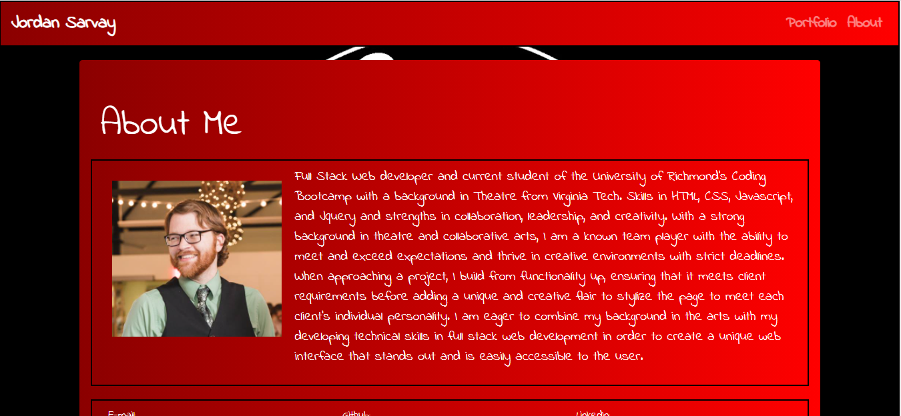
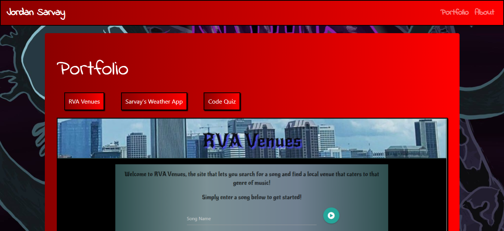

# JSarvay.github.io

Website designed using responsive design as well as bootstrap Grid layout for the portfolio website of Jordan Sarvay.

The about me page is designed to utilize a jumbotron to include a picture of Jordan as well as a general bio.

The contact form allows for three different areas of submission, including name, email, and a brief message describing what I can help them with.

The final portfolio section is where different projects i have worked on can be displayed. As this section is light in content and being developed for this course, all images have been taken by Macho Man Randy Savage.

The navbar is functional, allowing navigation to each page as well as changing to a hamburger menu on small displays. The main brand name also redirects to the main index page when clicked.

This website designed and copyrighted by Jordan Sarvay.

Any questions can be directed to him at jordans1@vt.edu or 804-305-4878

Deployed URL: https://jsarvay.github.io/

